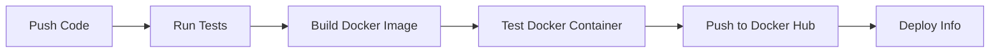

# 🔲 QR Code Generator Application with CI/CD

[](https://github.com/YOUR_USERNAME/qr-code-generator/actions)
[](https://www.docker.com/)
[](https://www.python.org/)
[](https://flask.palletsprojects.com/)

A modern, responsive QR Code Generator web application with complete **CI/CD pipeline** using **GitHub Actions** and **Docker**. Perfect for DevOps demonstrations!


---

## 📋 Table of Contents

- [Overview](#-overview)
- [Features](#-features)
- [Tech Stack](#-tech-stack)
- [Project Structure](#-project-structure)
- [Quick Start](#-quick-start)
- [Usage](#-usage)
- [CI/CD Pipeline](#-cicd-pipeline)
- [Docker Deployment](#-docker-deployment)
- [Testing](#-testing)
- [GitHub Actions Setup](#-github-actions-setup)
- [API Documentation](#-api-documentation)
- [Screenshots](#-screenshots)
- [Contributing](#-contributing)
- [License](#-license)

---

## 🎯 Overview

This project demonstrates a complete **DevOps workflow** for a Python web application:

- **Application**: Simple QR Code Generator (Flask backend + HTML/CSS/JS frontend)
- **Version Control**: GitHub for source code management
- **CI/CD**: GitHub Actions for automated testing, building, and deployment
- **Containerization**: Docker for consistent deployment across environments
- **Testing**: Automated unit tests with pytest

### How It Works

```
User Input (Text/URL) → Flask Backend → QR Code Generation → Image Output
```

---

## ✨ Features

### Application Features
- ✅ Generate QR codes from any text or URL
- ✅ Beautiful, responsive web interface
- ✅ Instant QR code generation
- ✅ Download QR codes as PNG images
- ✅ Mobile-friendly design
- ✅ Real-time error handling
- ✅ Health check endpoint for monitoring

### DevOps Features
- 🔄 Automated CI/CD pipeline with GitHub Actions
- 🐳 Docker containerization for easy deployment
- 🧪 Automated unit testing
- 📦 Multi-stage builds for optimized images
- 🚀 One-command deployment
- 📊 Build status monitoring

---

## 🛠 Tech Stack

| Category | Technology |
|----------|-----------|
| **Backend** | Python 3.11, Flask 3.0 |
| **QR Generation** | qrcode, Pillow |
| **Frontend** | HTML5, CSS3, Vanilla JavaScript |
| **Server** | Gunicorn |
| **Testing** | pytest |
| **CI/CD** | GitHub Actions |
| **Containerization** | Docker |
| **Version Control** | Git, GitHub |

---

## 📁 Project Structure

```
QR_gen/
├── .github/
│   └── workflows/
│       └── ci-cd.yml          # GitHub Actions CI/CD pipeline
├── templates/
│   └── index.html             # Frontend HTML interface
├── app.py                     # Flask backend application
├── test_app.py               # Unit tests
├── requirements.txt          # Python dependencies
├── Dockerfile                # Docker configuration
├── .dockerignore             # Docker ignore rules
├── .gitignore                # Git ignore rules
└── README.md                 # This file
```

---

## 🚀 Quick Start

### Prerequisites

- Python 3.11+ or Docker
- Git

### Option 1: Run Locally with Python

1. **Clone the repository**
   ```powershell
   git clone https://github.com/YOUR_USERNAME/qr-code-generator.git
   cd qr-code-generator
   ```

2. **Create virtual environment**
   ```powershell
   python -m venv venv
   .\venv\Scripts\Activate.ps1
   ```

3. **Install dependencies**
   ```powershell
   pip install -r requirements.txt
   ```

4. **Run the application**
   ```powershell
   python app.py
   ```

5. **Open browser**
   ```
   http://localhost:5000
   ```

### Option 2: Run with Docker

1. **Build the Docker image**
   ```powershell
   docker build -t qr-code-generator .
   ```

2. **Run the container**
   ```powershell
   docker run -d -p 5000:5000 --name qr-app qr-code-generator
   ```

3. **Access the application**
   ```
   http://localhost:5000
   ```

4. **Stop the container**
   ```powershell
   docker stop qr-app
   docker rm qr-app
   ```

---

## 💻 Usage

### Web Interface

1. Open `http://localhost:5000` in your browser
2. Enter any text or URL in the input field
3. Click **"Generate QR Code"**
4. View your QR code and click **"Download QR Code"** to save it

### API Usage

**Generate QR Code**

```bash
curl -X POST http://localhost:5000/generate \
  -H "Content-Type: application/json" \
  -d '{"text": "Hello World"}' \
  --output qrcode.png
```

**Health Check**

```bash
curl http://localhost:5000/health
```

Response:
```json
{
  "status": "healthy",
  "service": "QR Code Generator"
}
```

---

## 🔄 CI/CD Pipeline

The GitHub Actions workflow automatically runs on every push/pull request:

### Pipeline Stages



### Workflow Jobs

1. **Test** 
   - Set up Python 3.11
   - Install dependencies
   - Run pytest unit tests
   - Test QR generation functionality

2. **Build**
   - Build Docker image
   - Run container and test health endpoint
   - Save image as artifact

3. **Push to Docker Hub** (optional, on main branch)
   - Login to Docker Hub
   - Tag and push image
   - Create version tags

4. **Deploy Information**
   - Display deployment instructions

### View Pipeline

Check your pipeline status at:
```
https://github.com/YOUR_USERNAME/qr-code-generator/actions
```

---

## 🐳 Docker Deployment

### Docker Commands

**Build**
```powershell
docker build -t qr-code-generator .
```

**Run**
```powershell
docker run -d -p 5000:5000 --name qr-app qr-code-generator
```

**View Logs**
```powershell
docker logs qr-app
```

**Stop and Remove**
```powershell
docker stop qr-app
docker rm qr-app
```

**Run with custom port**
```powershell
docker run -d -p 8080:5000 --name qr-app qr-code-generator
```

### Docker Compose (Optional)

Create `docker-compose.yml`:

```yaml
version: '3.8'
services:
  qr-generator:
    build: .
    ports:
      - "5000:5000"
    environment:
      - PORT=5000
    restart: unless-stopped
```

Run with:
```powershell
docker-compose up -d
```

---

## 🧪 Testing

### Run Unit Tests

**With Python**
```powershell
pytest test_app.py -v
```

**With Coverage**
```powershell
pytest test_app.py --cov=app --cov-report=html
```

### Test Coverage

The test suite includes:
- ✅ Home page loading
- ✅ Health check endpoint
- ✅ QR code generation with text
- ✅ QR code generation with URLs
- ✅ Empty input validation
- ✅ Error handling
- ✅ Long text handling
- ✅ QR library functionality

---

## ⚙️ GitHub Actions Setup

### 1. Create GitHub Repository

```powershell
git init
git add .
git commit -m "Initial commit: QR Code Generator with CI/CD"
git branch -M main
git remote add origin https://github.com/YOUR_USERNAME/qr-code-generator.git
git push -u origin main
```

### 2. Enable GitHub Actions

GitHub Actions will automatically detect the `.github/workflows/ci-cd.yml` file and start running the pipeline.

### 3. Add Docker Hub Secrets (Optional)

To enable automatic Docker Hub pushes:

1. Go to your GitHub repository
2. Navigate to **Settings** → **Secrets and variables** → **Actions**
3. Add these secrets:
   - `DOCKER_USERNAME`: Your Docker Hub username
   - `DOCKER_PASSWORD`: Your Docker Hub password or access token

### 4. Monitor Pipeline

- Go to the **Actions** tab in your repository
- Watch your pipeline execute in real-time
- View logs and build artifacts

---

## 📚 API Documentation

### Endpoints

#### `GET /`
Returns the main web interface

**Response**: HTML page

---

#### `POST /generate`
Generates a QR code from text input

**Request Body**:
```json
{
  "text": "Your text or URL here"
}
```

**Success Response** (200):
- Content-Type: `image/png`
- Body: PNG image data

**Error Response** (400):
```json
{
  "error": "No text provided"
}
```

---

#### `GET /health`
Health check endpoint for monitoring

**Success Response** (200):
```json
{
  "status": "healthy",
  "service": "QR Code Generator"
}
```

---

## 🖼 Screenshots

### Main Interface
*A clean, modern interface for generating QR codes*

### QR Code Result
*Generated QR code with download option*

---

## 🎓 Learning Objectives

This project teaches:

1. **Flask Web Development**: Building RESTful APIs and serving web pages
2. **Frontend Development**: Creating responsive user interfaces
3. **Docker**: Containerizing applications for consistent deployment
4. **CI/CD**: Automating testing and deployment with GitHub Actions
5. **DevOps Practices**: Version control, automated testing, and continuous integration
6. **Python Testing**: Writing and running unit tests with pytest

---

## 🔧 Configuration

### Environment Variables

- `PORT`: Application port (default: 5000)
- `FLASK_ENV`: Environment mode (development/production)

### Customize

**Change Port**:
```powershell
$env:PORT=8080; python app.py
```

**Enable Debug Mode** (development only):
```python
# In app.py
app.run(host='0.0.0.0', port=port, debug=True)
```

---

## 📝 Contributing

Contributions are welcome! Please follow these steps:

1. Fork the repository
2. Create a feature branch (`git checkout -b feature/AmazingFeature`)
3. Commit your changes (`git commit -m 'Add some AmazingFeature'`)
4. Push to the branch (`git push origin feature/AmazingFeature`)
5. Open a Pull Request

---

## 🐛 Troubleshooting

### Port Already in Use
```powershell
# Find process using port 5000
netstat -ano | findstr :5000

# Kill the process (replace PID with actual process ID)
taskkill /PID <PID> /F
```

### Docker Build Issues
```powershell
# Clean Docker cache
docker system prune -a

# Rebuild without cache
docker build --no-cache -t qr-code-generator .
```

### Module Not Found
```powershell
# Reinstall dependencies
pip install --upgrade -r requirements.txt
```

---

## 📄 License

This project is licensed under the MIT License - see the LICENSE file for details.

---

## 👤 Author

**Your Name**
- GitHub: [@YOUR_USERNAME](https://github.com/YOUR_USERNAME)
- LinkedIn: [Your LinkedIn](https://linkedin.com/in/your-profile)

---

## 🙏 Acknowledgments

- [qrcode library](https://pypi.org/project/qrcode/) for QR code generation
- [Flask](https://flask.palletsprojects.com/) for the web framework
- [Docker](https://www.docker.com/) for containerization
- [GitHub Actions](https://github.com/features/actions) for CI/CD

---

## 📈 Project Status

✅ **Production Ready**

- All features implemented
- Tests passing
- Docker deployment working
- CI/CD pipeline active

---

## 🚀 Next Steps

Potential enhancements:
- [ ] Add QR code customization (colors, logos)
- [ ] Support for different QR code types (WiFi, vCard, etc.)
- [ ] QR code scanner functionality
- [ ] User accounts and QR code history
- [ ] Analytics dashboard
- [ ] Kubernetes deployment
- [ ] Cloud deployment (AWS/Azure/GCP)

---

**Made with ❤️ for DevOps Learning**
